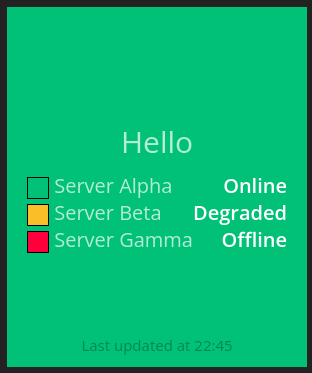

# hot-list-status

This is a fork of the Hot Status Widget to show mini statuses as part of a larger state.
It essentially mashes the List widget and the Hot Status widget together.



## About

It is designed to create detailed green/orange/red monitoring dashboards.

## Installation

Create a subdirectory in your widgets directory called hot_list_status. Insert the three files (hot_list_status.coffee, hot_list_status.scss, hot_list_status.html).

Alternately, you can use the automated dashing installer by running dashing install 150faddf6c637279fe117dd3cb041553 from the root of your dashing project.

## Usage

Include a widget with a `data-view` of `HotListStatus` and send a data dict similar to
feeding the List widget but with an additional "status" arg.

Eg.

```
<li data-row="1" data-col="1" data-sizex="1" data-sizey="1">                                                
  <div data-id="the-widget" data-view="HotStatus" data-title="Example"></div>
</li>
```

```
curl -X POST -H 'Content-Type: application/json' -d '{ "auth_token": "YOUR_AUTH_TOKEN", "items": [{"label": "X", "value": "Y", "status": "ok"}, {"label": "Z", "value": "Z", "status": "critical"}], "status": "ok"}' http://localhost:3030/widgets/the-widget
```

## Thanks

Thanks to the Hot Status Widget author as it's forked from that.

## License

The colour schemes and this widget are licensed under a [Creative Commons Attribution-NonCommercial-ShareAlike 3.0](http://creativecommons.org/licenses/by-nc-sa/3.0/) license.


